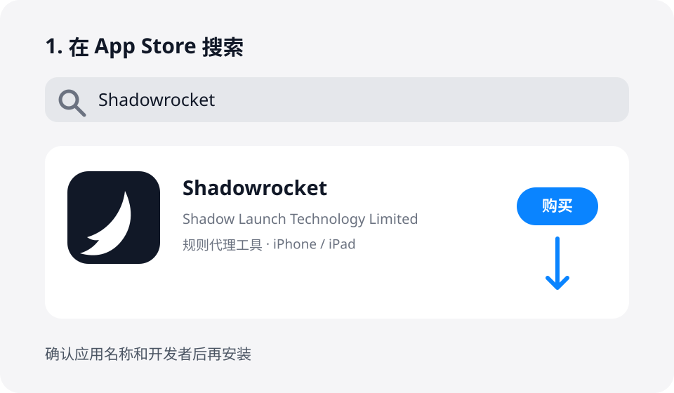
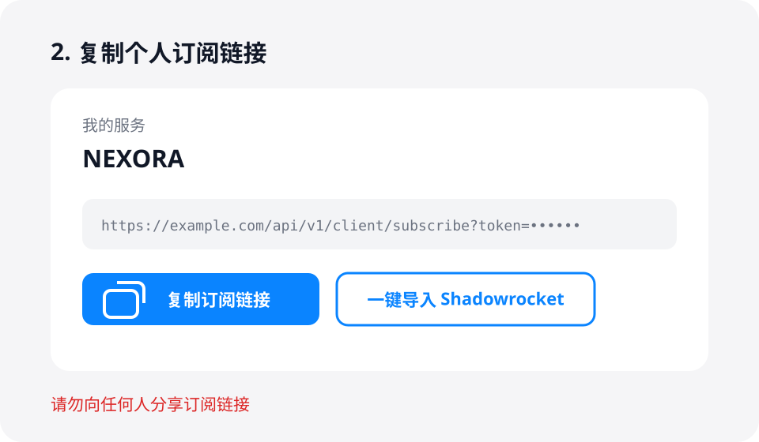
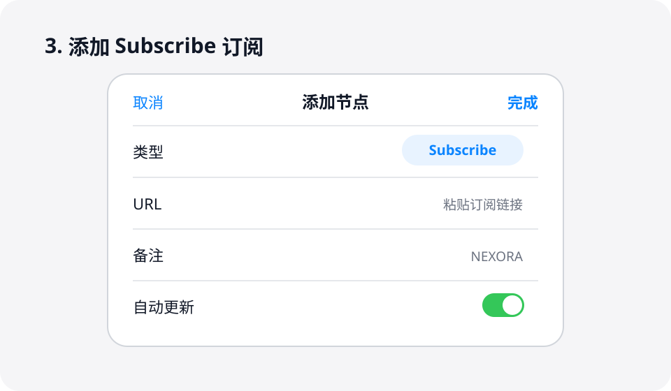
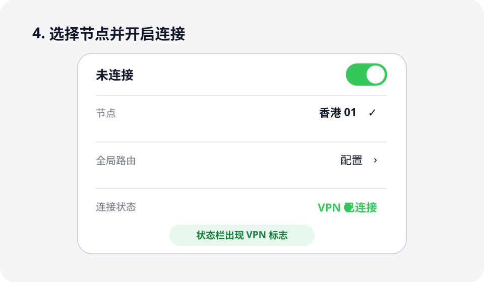

# Shadowrocket 使用教程

本教程适用于 iPhone 和 iPad。不同版本的按钮位置可能略有差异，操作名称基本一致。

:::info 使用前准备

- 一台 iPhone 或 iPad
- 可以下载 Shadowrocket 的非中国大陆地区 Apple ID
- 从本站用户中心获取的个人订阅链接

:::

## 1. 下载 Shadowrocket

1. 打开 **App Store**，登录可下载 Shadowrocket 的 Apple ID。
2. 搜索 **Shadowrocket**，确认开发者为 **Shadow Launch Technology Limited** 后购买并安装。
3. 安装完成后打开应用。

:::warning

Shadowrocket 是付费应用。请通过 App Store 正版购买，不要安装来源不明的安装包，也不要把 Apple ID 密码交给他人。

:::

## 2. 复制个人订阅链接

1. 登录本站用户中心。
2. 在服务或订阅区域找到 **订阅链接**。
3. 点击 **复制订阅链接**。如果页面提供 **一键导入 Shadowrocket**，也可以直接点击并允许打开 Shadowrocket。

:::danger

订阅链接包含你的账户凭证，请勿截图分享或发送给他人。链接泄露后请立即在用户中心重置订阅。

:::

## 3. 在 Shadowrocket 中添加订阅

如果没有使用一键导入，请手动添加：

1. 打开 Shadowrocket，点击首页右上角的 **＋**。
2. 点击 **类型**，选择 **Subscribe（订阅）**。
3. 在 **URL** 中粘贴刚才复制的订阅链接。
4. 在 **备注** 中填写一个容易识别的名称，例如 `NEXORA`。
5. 点击右上角 **完成**，等待节点列表加载。

:::tip

如果提示订阅失败，请先确认链接没有多余空格，并使用 Safari 打开用户中心重新复制一次。

:::

## 4. 选择节点并连接

1. 回到 Shadowrocket 首页，在节点列表中选择一个节点。
2. 将 **全局路由** 保持为 **配置**；如客服另有说明，请按客服提供的模式设置。
3. 打开页面顶部的连接开关。
4. 首次连接时，系统会请求添加 VPN 配置，点击 **允许** 并完成 Face ID、Touch ID 或密码验证。
5. 顶部状态栏出现 **VPN** 标志后，即表示连接成功。

## 5. 更新订阅

当节点发生变化或无法连接时，在首页找到订阅名称，向左滑动并点击 **更新**。部分版本需要长按订阅名称后选择 **更新订阅**。

更新完成后重新选择节点并连接即可。

## 常见问题

### 点击连接后没有反应

前往 **系统设置 → 通用 → VPN 与设备管理 → VPN**，确认已存在 Shadowrocket 配置；没有时返回应用重新打开开关并允许添加配置。

### 节点全部超时

先切换 Wi-Fi 和蜂窝网络测试，再更新订阅并更换节点。仍无法使用时，请联系网站右下角客服。

### 更换手机后如何恢复

使用原 Apple ID 在 App Store 的已购项目中重新下载 Shadowrocket，再从用户中心复制订阅链接并按本教程重新添加。

